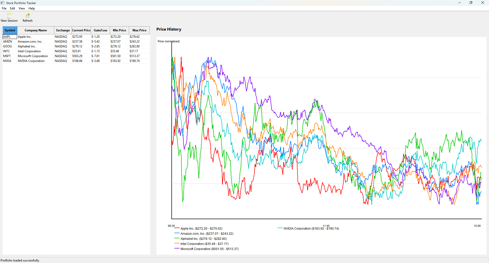

# Stock Portfolio Tracker


A modern desktop application built with C++23 and wxWidgets to track and manage stock portfolios with real-time market data from Yahoo Finance.



## Features

- **Portfolio Management**: Create and track multiple stock portfolios with company information
- **Real-Time Market Data**: Fetch live stock prices from Yahoo Finance API
- **Price History Visualization**: Interactive chart displaying normalized price history for all tracked companies
- **Comprehensive Analytics**:
  - Current price tracking
  - Gain/Loss calculation (delta between oldest and newest price)
  - Min/Max price range analysis
  - Company details (name, exchange, symbol)
- **Responsive UI**: Split-panel interface with resizable grid and chart
- **Auto-Refresh**: Manual refresh capability (F5) to update all price data
- **Multi-Company Support**: Track up to 15 companies simultaneously with color-coded visualization

## Technical Highlights

- **Modern C++23**: Leverages modules, ranges (zip, filter, transform), and structured bindings
- **Cross-Platform GUI**: Built with wxWidgets 3.3.1
- **Domain-Driven Design**: Clean separation between domain models, infrastructure, and application layers
- **Yahoo Finance Integration**: Real-time intraday data with 1-minute intervals
- **Normalized Chart Scaling**: Each company's price history is independently scaled for optimal visualization

## Requirements

- **Compiler**: MSVC with C++23 support (Visual Studio 2022 or later)
- **CMake**: 3.20 or higher
- **vcpkg**: For dependency management
- **Dependencies** (managed via vcpkg):
  - wxWidgets 3.3.1
  - nlohmann-json
  - libcurl

## Building the Project

1. **Clone the repository**:
   ```bash
   git clone https://github.com/fernandoagomezf/app_stockportfolio_cpp.git
   cd app_stockportfolio_cpp
   ```

2. **Configure with CMake**:
   ```bash
   cmake --preset=msvc
   ```

3. **Build**:
   ```bash
   cmake --build build/msvc --config Debug
   ```

4. **Run**:
   ```bash
   .\build\msvc\Debug\spt.exe
   ```

## Usage

1. **Create a New Session**: Click the "New Session" button or use File → New Session
2. **Add Companies**: Search for companies by symbol and add them to your portfolio
3. **View Data**: The grid displays all company information, prices, and analytics
4. **Refresh Prices**: Press F5 or use View → Refresh Prices to update market data
5. **Analyze Trends**: View the price history chart with normalized scaling and legend

## Project Structure

```
app_stockportfolio_cpp/
├── src/
│   ├── spt.domain/          # Domain models (Company, Portfolio, Transaction, etc.)
│   ├── spt.infrastructure/  # External services (Yahoo Finance API, HTTP client)
│   └── spt.app/            # Application layer (UI, Window, Dialogs)
├── docs/                    # Documentation and screenshots
├── CMakeLists.txt          # CMake configuration
├── vcpkg.json              # Dependency manifest
└── README.md

```

## Architecture

The application follows a layered architecture:

- **Domain Layer**: Core business logic with entities like `Company`, `Portfolio`, `Transaction`, `PricePoint`
- **Infrastructure Layer**: External integrations including `YahooPriceFetcher`, `HttpClient`, `JsonParser`
- **Application Layer**: User interface with wxWidgets, including the main `Window` and `PortfolioDialog`

## License

This project is licensed under the MIT License - see the [LICENSE](LICENSE) file for details.

## Acknowledgments

- Market data provided by [Yahoo Finance](https://finance.yahoo.com/)
- Built with [wxWidgets](https://www.wxwidgets.org/)
- Dependency management via [vcpkg](https://vcpkg.io/) 